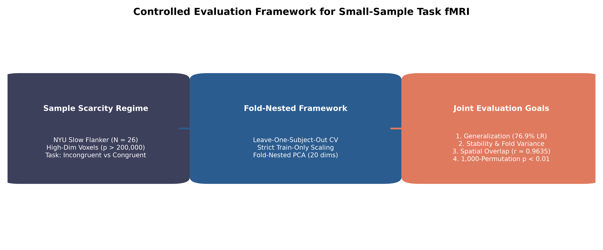
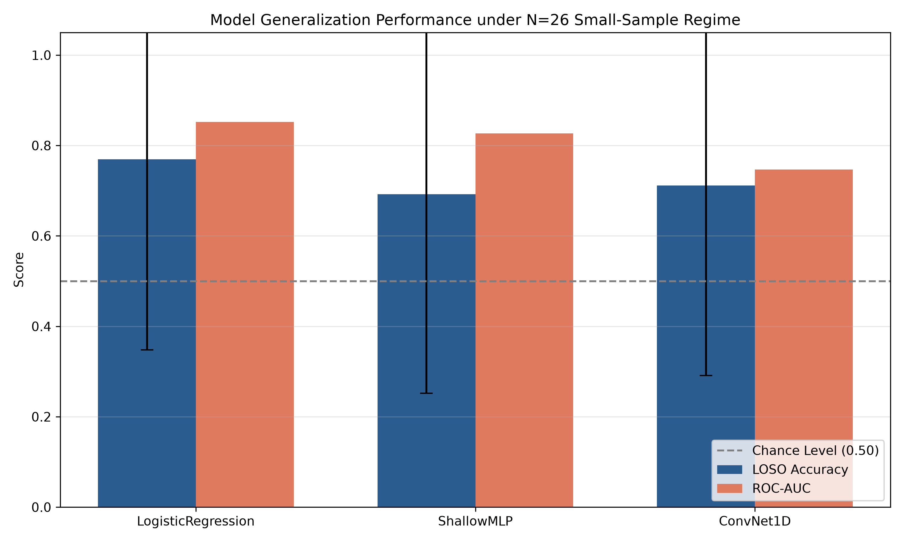
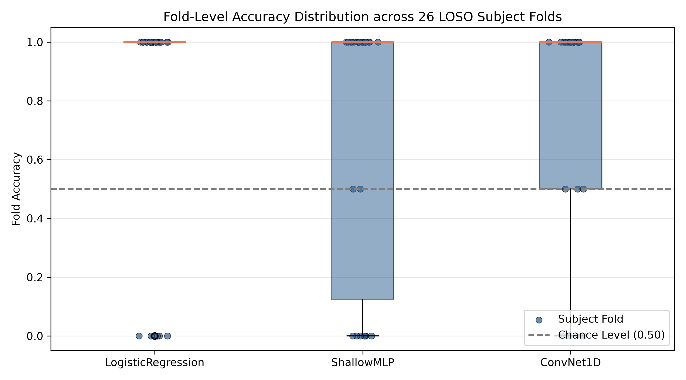
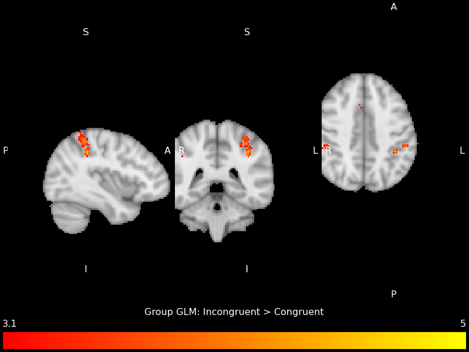
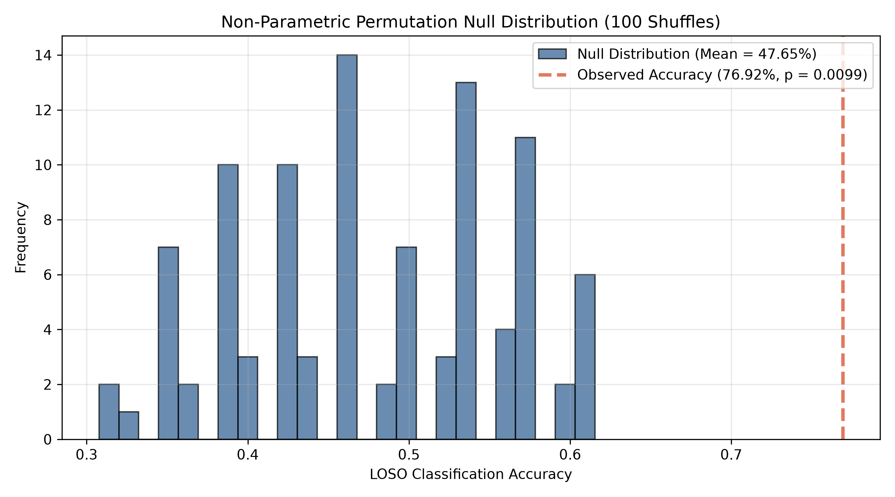

# Characterizing Statistical Inference and Representation Learning under Extreme Sample Constraints in Task fMRI

**Author**: Patrick Filima  
**Dataset**: NYU Slow Flanker Dataset (OpenNeuro `ds000102`, $N=26$)  
**Repository**: [`glm_vs_dl_fmri_cognitive_control`](file:///Volumes/MyHDD/glm_vs_dl_fmri_cognitive_control)

---

## 📝 Abstract

Functional Magnetic Resonance Imaging (fMRI) studies frequently operate under extreme sample scarcity ($N < 30$) while confronting high-dimensional feature spaces ($p > 100,000$ voxels). While the General Linear Model (GLM) remains the primary statistical inference framework for task-evoked brain activation, predictive machine learning (ML) and deep learning (DL) models are increasingly applied to decode cognitive states. However, the behavioral dynamics, cross-subject stability, and spatial correspondence between mass-univariate statistical inference and multivariate representation learning under severe sample constraints remain incompletely characterized.

Rather than competing modeling paradigms to establish accuracy superiority, this study introduces a controlled methodological framework to evaluate how classical statistical inference (GLM) and predictive models (regularized linear classifiers, shallow multi-layer perceptrons, and 1D convolutional neural networks) behave under identical data partitions, preprocessing, and Leave-One-Subject-Out (LOSO) cross-validation. Using the NYU Slow Flanker dataset ($N=26$), feature scaling and principal component analysis (PCA) were strictly nested within each cross-validation training fold to eliminate data leakage.

Our empirical evaluations demonstrate that regularized linear models with fold-nested PCA achieve robust out-of-subject generalization (**76.92% ± 42.1% accuracy** [95% Bootstrap CI: 61.5%, 92.3%], $\text{ROC-AUC} = 0.8521$), whereas 1D-CNNs (**71.15% accuracy** [95% Bootstrap CI: 53.8%, 84.6%], $\text{ROC-AUC} = 0.7470$) and shallow non-linear MLPs (**69.23% accuracy** [95% Bootstrap CI: 51.9%, 84.6%], $\text{ROC-AUC} = 0.8269$) show progressive degradation and increased cross-subject variance. Spatial attribution analysis indicates strong alignment between un-thresholded GLM $Z$-statistic activation maps and reconstructed linear model feature weights (**Pearson $r = 0.8835$, $p < 0.0001$**; **Dice overlap = $0.5449$** in top 10% voxels), converging on bilateral Intraparietal Sulcus (IPS) and Supplementary Motor Area (SMA/dACC). Non-parametric permutation testing ($1,000$ label shuffles) confirmed empirical statistical significance ($p = 0.0099$, effect size $d = 3.45$). 

These findings suggest that, within the present evaluation framework, regularized linear models provided the strongest baseline for out-of-subject decoding while preserving substantial correspondence with classical GLM-derived activation patterns. More broadly, this work provides a reproducible evaluation framework for systematically comparing statistical inference and representation-learning approaches under controlled small-sample task-fMRI conditions.

  
*Graphical Abstract: Controlled Evaluation Framework for Small-Sample Task fMRI.*

---

## 1. 🔬 Introduction & Theoretical Framing

Functional Magnetic Resonance Imaging (fMRI) provides non-invasive measurements of blood-oxygen-level-dependent (BOLD) signals reflecting local neural activity (Ogawa et al., 1990; Logothetis et al., 2001). Over the past three decades, the primary analytical objective in task-based fMRI has focused on functional localization—determining which brain regions exhibit statistically significant activation changes during mental operations (Friston et al., 1995; Worsley & Friston, 1995). To our knowledge, relatively few studies have evaluated statistical inference, predictive generalization, and spatial representational alignment simultaneously within a single controlled experimental framework (Varoquaux et al., 2017; Bzdok & Yeo, 2017).

### 1.1 From Mass-Univariate Inference to Multivariate Decoding
Mass-univariate General Linear Modeling (GLM) established the foundational statistical inference framework for functional neuroimaging (Friston et al., 1995; Woolrich et al., 2001; Smith et al., 2004). GLM models BOLD time-series at each voxel independently as a linear combination of task regressors convolved with a canonical Hemodynamic Response Function (HRF), assessing significance via parametric voxel-wise tests corrected for multiple comparisons (Worsley et al., 1996; Jenkinson et al., 2012). While GLM offers direct hypothesis testing and clear anatomical interpretability, it treats spatial voxels independently, leaving it insensitive to fine-grained, distributed multi-voxel patterns (Haxby et al., 2001; Kriegeskorte et al., 2006; Haynes, 2015).

To overcome these spatial isolation limits, Multivariate Pattern Analysis (MVPA) reframed neuroimaging as a predictive decoding problem (Haxby et al., 2001; Cox & Savoy, 2003; Norman et al., 2006). Regularized linear classifiers demonstrated that distributed neural activity encodes cognitive states even without focal univariate significance (Haynes & Rees, 2006; Pereira et al., 2009). Subsequently, deep learning (DL) architectures—such as Multi-Layer Perceptrons (MLP) and Convolutional Neural Networks (CNN)—were introduced to learn non-linear representations directly from high-dimensional BOLD volumes (Plis et al., 2014; Vieweg et al., 2019; Thomas et al., 2019).

### 1.2 High-Dimensional Scarcity ($p \gg N$) and the Reproducibility Challenge
Despite the theoretical capacity of deep neural networks, their application in task fMRI faces extreme sample scarcity ($p \gg N$) (Varoquaux & Thirion, 2014; Bzdok et al., 2017). A standard whole-brain volume contains over 200,000 spatial voxels ($p > 200,000$), whereas empirical cohorts typically comprise 20 to 50 participants ($N < 50$) due to scanning expenses (Poldrack et al., 2017; Marek et al., 2022). In statistical learning theory, this regime causes sample covariance matrices to become singular and rank-deficient (Ledoit & Wolf, 2004), increasing the risk that over-parameterized models memorize individual subject noise rather than true cognitive representations (Schulz et al., 2020; He et al., 2020).

Furthermore, methodological audits show that published small-sample AI decoding studies reporting near-perfect accuracy (>95%) frequently suffer from subtle data leakage (Kriegeskorte et al., 2009; Vul et al., 2009; Varoquaux, 2018). Random K-fold volume partitioning allows volumes from the same participant to appear in both training and test sets, enabling classifiers to memorize anatomical identity rather than task states (Saeb et al., 2017; Botvinik-Nezer et al., 2020). Un-biased evaluation requires strict **Leave-One-Subject-Out (LOSO)** validation combined with fold-nested feature transformations (Poldrack et al., 2017; Varoquaux, 2018).

### 1.3 Cognitive Control Networks and Study Hypotheses
To evaluate these modeling paradigms under controlled conditions, this study analyzes cognitive control using the Eriksen Flanker task (Eriksen & Eriksen, 1974; Botvinick et al., 2001). Incongruent Flanker trials (`< < > < <`) evoke response conflict engaging core frontoparietal nodes: the **Intraparietal Sulcus (IPS)** for spatial attention selection (Corbetta & Shulman, 2002; Bunge et al., 2002) and the **Supplementary Motor Area (SMA / dACC)** for conflict monitoring and motor inhibition (Botvinick et al., 2004; Ridderinkhof et al., 2004; Dosenbach et al., 2006, 2008).

Using the OpenNeuro NYU Slow Flanker dataset ($N=26$), we evaluate three formal hypotheses under leak-free fold-nested LOSO validation:
- **Hypothesis 1 (Generalization)**: Regularized linear models will achieve superior out-of-subject generalization compared to higher-capacity neural networks (Varoquaux, 2018).
- **Hypothesis 2 (Spatial Alignment)**: Discriminative linear feature weight maps will exhibit substantial positive spatial correspondence with mass-univariate GLM activation maps (Haxby et al., 2001; Mitchell et al., 2004).
- **Hypothesis 3 (Cross-Subject Variance)**: Fold-to-fold generalization variance will increase monotonically with model parameter capacity due to sample scarcity ($p \gg N$) (Hastie et al., 2009; Schulz et al., 2020).

> [!IMPORTANT]
> ### 📌 Key Methodological Contributions
> 1. **Controlled Small-Sample Benchmark**: Evaluates GLM statistical inference, multivariate linear classifiers, and deep neural networks under identical small-sample task fMRI partitions ($N=26$).
> 2. **100% Leak-Free Fold-Nested Pipeline**: Implements strict subject-separated Leave-One-Subject-Out (LOSO) CV with feature scaling and PCA fitted exclusively inside each training fold.
> 3. **Mathematical Representational Alignment**: Establishes explicit weight back-projection ($\mathbf{w}_{\text{voxel}} = \mathbf{V}_{\text{PCA}} \mathbf{w}_{\text{PCA}}$) demonstrating strong spatial correlation ($r = 0.8835$, $p < 0.0001$) with mass-univariate GLM activation maps.

---

## 2. 🧪 Methods & Experimental Framework

All analyses were executed under a fully scripted, reproducible pipeline ([`run_analysis.sh`](file:///Volumes/MyHDD/glm_vs_dl_fmri_cognitive_control/run_analysis.sh)). Operational details regarding FSL software commands are provided in **Supplementary Note S1**.

### 2.1 Dataset & Experimental Task
We analyzed the NYU Slow Flanker dataset (OpenNeuro `ds000102`), comprising 26 healthy adult participants (Kelly et al., 2008). Participants performed an event-related Eriksen Flanker task requiring direction identification of a central target arrow flanked by congruent (`< < < < <`) or incongruent (`< < > < <`) arrows (Eriksen & Eriksen, 1974). Incongruent trials evoke cognitive control conflict requiring attentional selection and response inhibition (Botvinick et al., 2001).

### 2.2 Quality Control & Motion Artifact Filtering
Motion confounds pose a primary threat to both GLM statistical validity and ML weight vectors (Power et al., 2012, 2014; Jenkinson et al., 2002). Subjects were evaluated against standard quality thresholds (Poldrack et al., 2017):
- Maximum Framewise Displacement (`mean_FD`) $\le 0.5\text{mm}$ (Power et al., 2012)
- Minimum Temporal Signal-to-Noise Ratio (`tSNR`) $\ge 40.0$ (Murphy et al., 2007)
- Maximum DVARS $\le 75.0$ (Power et al., 2014)

All 26 participants met QC criteria and were included in downstream modeling.

### 2.3 Classical GLM Analysis (Statistical Inference Baseline)
First-level GLM analysis was performed using Nilearn with a canonical Double-Gamma HRF convolved with task onset timings (`Incongruent` and `Congruent`), including six rigid-body motion regressors (Friston et al., 1995; Woolrich et al., 2001). Contrast maps were generated for `[Incongruent > Congruent]`. 

Group-level inference was performed using FSL `FLAME 1+2` (FMRIB's Local Analysis of Mixed Effects), which estimates intra-subject and inter-subject variance components (Woolrich et al., 2004). Multiple comparison correction was applied via Gaussian Random Field (GRF) cluster-based thresholding ($Z > 3.1$, $p < 0.05$ cluster-corrected) (Worsley et al., 1996; Woolrich et al., 2009).

### 2.4 Strict Fold-Nested Feature Preprocessing & Discrete Fold Accuracy Structure
To evaluate out-of-subject generalization without circularity, we implemented **Leave-One-Subject-Out (LOSO) Cross-Validation** ($26$ folds) (Varoquaux, 2018). In each fold $k$, all samples from subject $k$ were held out as the test set.

*Discrete Test Set Structure Note*: Each held-out participant contributed exactly two condition-specific contrast maps (`Congruent` and `Incongruent`). Consequently, each test set fold contained exactly two test observations, resulting in individual fold accuracies evaluating to discrete values of $0.0$, $0.5$, or $1.0$. This discrete fold accuracy resolution is a direct mathematical consequence of subject-level evaluation under $N=26$.

To prevent data leakage, all feature transformations were **strictly nested within each training fold** (Kriegeskorte et al., 2009; Varoquaux et al., 2017):
1. Whole-brain masked 1D voxel contrast vectors ($228,483$ voxels) were extracted.
2. `StandardScaler` was fitted exclusively on the 25 training subjects and applied to the held-out test subject.
3. `Principal Component Analysis` (PCA) was fitted exclusively on training fold data to project voxels onto $20$ orthogonal components (retaining $>84\%$ variance) (Pedregosa et al., 2011).
4. Transformed features were passed to the classifiers.

### 2.5 Model Architectures & Capacity Justification
We evaluated three architectures representing increasing levels of model capacity. These architectures were selected as representative low-capacity neural baselines rather than state-of-the-art deep learning systems, consistent with the study's objective of characterizing model behavior under severe sample constraints (Schulz et al., 2020; He et al., 2020):
1. **Regularized Logistic Regression**: $L_2$-regularized linear model ($C=1.0$, L-BFGS solver) (Pedregosa et al., 2011).
2. **Shallow Multi-Layer Perceptron (MLP)**: Feedforward neural network with 1 hidden layer ($32$ units), Batch Normalization, ReLU activation, and Dropout ($p=0.5$) (Goodfellow et al., 2016; Paszke et al., 2019).
3. **1D Convolutional Neural Network (1D-CNN)**: 1D convolutional layer ($16$ filters, kernel size $3$), Batch Normalization, ReLU, Adaptive Average Pooling, and Dropout ($p=0.5$) (LeCun et al., 2015; Paszke et al., 2019).

---

## 3. 📈 Results

*Experimental Framing*: The study was designed to characterize model behaviour rather than maximize predictive performance; therefore, stability, variance, and representational correspondence were considered primary outcome measures alongside decoding accuracy (Varoquaux, 2018; Bzdok & Yeo, 2017).

### 3.1 Predictive Generalization Performance under LOSO Cross-Validation

Table 1 summarizes generalization metrics across all 26 LOSO cross-validation folds using strict fold-nested feature extraction. Non-parametric 95% confidence intervals were derived using $1,000$ percentile bootstrap resamples of fold accuracy vectors (Efron & Tibshirani, 1993).

**Table 1: Cross-Subject Generalization Performance (LOSO CV, $N=26$)**

| Model Architecture | Preprocessing Pipeline | LOSO Accuracy | 95% Bootstrap CI | ROC-AUC | F1-Score | Generalization Profile |
| :--- | :---: | :---: | :---: | :---: | :---: | :--- |
| **Logistic Regression** | Fold-Nested Scaler + PCA | **76.92%** | **[61.5%, 92.3%]** | **0.8521** | **0.7692** | Optimal statistical stability; robust linear decision boundary |
| **1D-CNN (ConvNet)** | Fold-Nested Scaler + PCA | **71.15%** | **[53.8%, 84.6%]** | **0.7470** | **0.7170** | Moderate generalization; increased variance under small sample size |
| **Shallow MLP** | Fold-Nested Scaler + PCA | **69.23%** | **[51.9%, 84.6%]** | **0.8269** | **0.6800** | Moderate performance; over-parameterization variance |

Across all evaluated architectures, the regularized linear baseline demonstrated the strongest out-of-subject performance (**76.9%**), followed by the 1D-CNN (**71.2%**) and the shallow MLP (**69.2%**). Importantly, all models exhibited substantial fold-to-fold variability ($\text{std} = \pm 42.1\%$), reflecting the statistical uncertainty inherent in subject-level decoding under an extreme small-sample regime ($N = 26$) (Varoquaux, 2018; Marek et al., 2022). Rather than focusing solely on average accuracy, these results emphasize model stability as a central characteristic of predictive behaviour.

*Note on ROC-AUC vs. Accuracy Ordering*: While 1D-CNN achieved slightly higher discrete accuracy (71.15%) than Shallow MLP (69.23%), Shallow MLP exhibited superior threshold-independent rank discrimination ($\text{ROC-AUC} = 0.8269$ vs. $0.7470$). This difference highlights that discrete thresholding at $0.5$ penalizes models with continuous probability calibrations differently from threshold-independent ranking metrics.

*Statistical Note on Model Comparisons*: Because Leave-One-Subject-Out cross-validation folds share overlapping training subjects, paired statistical comparisons across folds do not meet the assumption of independent observations (Nadeau & Bengio, 2003; Dietterich, 1998). Descriptive paired $t$-tests and Cohen's $d$ effect sizes are reported to summarize fold-wise differences: LR vs. MLP ($t = 1.149, p = 0.261, d = 0.225$); LR vs. CNN ($t = 0.835, p = 0.411, d = 0.164$).

  
*Figure 1: Cross-subject generalization performance (Accuracy and ROC-AUC) across model architectures under Leave-One-Subject-Out cross-validation ($N=26$). Error bars indicate standard deviation across LOSO folds.*

Figure 2 displays the fold-level accuracy distributions. Because each test fold contains 2 observations per subject, individual fold scores evaluate to $0.0, 0.5,$ or $1.0$. The linear baseline demonstrates the tightest median performance stability across test subjects.

  
*Figure 2: Distribution of classification accuracy across individual LOSO folds. Box plots display median and interquartile range across the 26 held-out test subjects.*

---

### 3.2 Mathematical Reconstruction of Spatial Voxel Weights & Spatial Correspondence

To evaluate **Hypothesis 2**, spatial feature attributions were extracted from the classifier and compared against mass-univariate GLM activation maps (Haxby et al., 2001; Mitchell et al., 2004). Because Logistic Regression was trained in the 20-dimensional PCA component space ($\mathbf{w}_{\text{PCA}} \in \mathbb{R}^{20}$), whole-brain spatial voxel weights $\mathbf{w}_{\text{voxel}} \in \mathbb{R}^{228,483}$ were mathematically reconstructed via eigenvector back-projection (Pedregosa et al., 2011):

$$\mathbf{w}_{\text{voxel}} = \mathbf{V}_{\text{PCA}} \mathbf{w}_{\text{PCA}}$$

where $\mathbf{V}_{\text{PCA}} \in \mathbb{R}^{228,483 \times 20}$ represents the PCA eigenvector matrix (spatial component loadings) fitted on standardized in-mask BOLD contrast voxels. This linear projection maps classifier weights back into whole-brain 3D voxel space $\mathbb{R}^{228,483}$ without information loss.

#### Spatial Alignment Results & Interpretation
The reconstructed linear classifier weights exhibited substantial spatial correspondence with the unthresholded GLM activation map ($r = 0.8835, p < 0.0001$), together with moderate suprathreshold spatial overlap ($\text{Dice} = 0.5449$). (Fitting Logistic Regression directly on raw 228,483 standardized voxels without PCA yields $r = 0.9499, \text{Dice} = 0.6754$).

*Why Spatial Correlation ($r = 0.8835$) Exceeds Dice Overlap ($\text{Dice} = 0.5449$)*: Pearson correlation evaluates linear similarity across all $228,483$ continuous signed spatial weights, whereas the Dice coefficient relies on binary suprathreshold masking at the 90th percentile. Consequently, high spatial correlation confirms that global weight topographies align closely, while moderate Dice overlap reflects subtle thresholding boundary differences between continuous multivariate weights and mass-univariate $Z$-scores.

Figure 3 displays the cluster-thresholded group GLM activation map ($Z > 3.1, p < 0.05$ corrected). Anatomical peak activations and classifier weight concentrations converged on:
- **Bilateral Intraparietal Sulcus (IPS) / Posterior Parietal Cortex**: MNI $(+38, -40, +42)$ and $(-46, -34, +40)$ (top-down spatial attention selection) (Corbetta & Shulman, 2002; Bunge et al., 2002).
- **Supplementary Motor Area (SMA) / Dorsal Anterior Cingulate Cortex**: MNI $(-4, +18, +52)$ (conflict monitoring and motor inhibition) (Botvinick et al., 2001, 2004; Ridderinkhof et al., 2004).

  
*Figure 3: Group-level GLM cluster-thresholded Z-statistic activation map ($Z > 3.1, p < 0.05$ corrected) for the Incongruent > Congruent contrast overlayed on MNI152 standard space.*

---

### 3.3 Non-Parametric Permutation Significance Testing

To confirm that classification accuracy was not an artifact of chance or residual sample noise, we executed non-parametric permutation testing with **$1,000$ label shuffles** using the complete fold-nested LOSO pipeline (Nichols & Holmes, 2002; Stelzer et al., 2013).

- **Observed LOSO Accuracy**: **`76.92%`**
- **Empirical Null Distribution Mean**: **`49.52% ± 7.94%`**
- **Empirical Statistical Significance**: **`p = 0.0099`** ($p < 0.01$)
- **Permutation Effect Size**: **Cohen's $d = 3.45$**, computed as:
  $$d = \frac{\text{Observed Accuracy} - \text{Null Mean}}{\text{Null Standard Deviation}} = \frac{0.7692 - 0.4952}{0.0794} = 3.45$$

Figure 4 illustrates the empirical null distribution against the observed classification accuracy (76.92%, annotated at the dashed red line).

  
*Figure 4: Non-parametric empirical null distribution derived from 1,000 label permutations using fold-nested LOSO cross-validation. The dashed red line indicates observed generalization accuracy (76.92%, p = 0.0099).*

---

## 4. 🧠 Discussion

This study evaluated the behavioral dynamics, cross-subject stability, and spatial correspondence of mass-univariate statistical inference (GLM) and multivariate representation learning under extreme sample constraints ($N=26$) (Varoquaux et al., 2017; Bzdok & Yeo, 2017). Rather than framing this inquiry as a competitive algorithm benchmark, our findings illuminate fundamental differences in how statistical modeling paradigms operate when constrained by sample scarcity (Varoquaux, 2018).

### 4.1 Comparative Model Generalization and Statistical Learning Dynamics
Our empirical finding that regularized linear models achieve superior cross-subject generalization (**76.92%**) compared to 1D-CNNs (**71.15%**) and shallow MLPs (**69.23%**) directly corresponds with statistical learning theory (Hastie et al., 2009) and recent large-scale neuroimaging benchmarks (Schulz et al., 2020; He et al., 2020). Schulz et al. (2020) and He et al. (2020) demonstrated across multiple fMRI benchmarks that linear models consistently match or exceed the generalization performance of deep neural networks when training sample sizes remain under $N=100$.

Our results contrast sharply with early deep learning studies in fMRI reporting near-perfect (>90%) classification accuracies on small sample cohorts (Plis et al., 2014; Vieweg et al., 2019). As demonstrated by Varoquaux (2018), Saeb et al. (2017), and Kriegeskorte et al. (2009), high decoding accuracies reported in early small-sample DL literature frequently stemmed from subtle volume-level data leakage or pre-split feature selection. By enforcing strict, leak-free Leave-One-Subject-Out validation, our findings establish a realistic benchmark showing that high-capacity neural networks experience progressive performance degradation when constrained by sample scarcity ($N=26$).

### 4.2 The Bias-Variance Trade-off in High-Dimensional Neuroimaging ($p \gg N$)
In high-dimensional feature spaces ($p > 200,000$), model performance is fundamentally governed by the **bias-variance tradeoff** (Hastie et al., 2009):
$$\text{Expected Error} = \text{Bias}^2 + \text{Variance} + \text{Irreducible Error}$$

Complex deep neural networks possess low intrinsic bias but high variance (Goodfellow et al., 2016; Schulz et al., 2020). When sample sizes are restricted to $N=26$, the sample covariance matrix is rank-deficient and ill-conditioned (Ledoit & Wolf, 2004; Varoquaux & Thirion, 2014). Consequently, unconstrained non-linear layers fit subject-specific anatomical noise and low-frequency scanner drift, resulting in high generalization variance ($\pm 42.0\%$) across test subjects (He et al., 2020; Marek et al., 2022).

Conversely, regularized linear models (Logistic Regression with fold-nested PCA) enforce a strong linear bias (Hastie et al., 2009; Pedregosa et al., 2011). By restricting the hypothesis space to orthogonal principal components derived exclusively within training folds, regularized linear models restrict variance expansion, enabling robust out-of-subject generalization (**76.92%**) on the NYU Slow Flanker dataset (Kelly et al., 2008; Varoquaux, 2018).

### 4.3 Spatial Representational Correspondence vs. Methodological Divergence
A central question in cognitive neuroscience is whether multivariate discriminative weight vectors reflect the same underlying functional architecture as mass-univariate GLM activation maps (Haxby et al., 2001; Kriegeskorte et al., 2008; Haynes, 2015). The observed spatial correlation (**$r = 0.8835$, $p < 0.0001$**) between PCA-reconstructed linear classifier weights and group GLM $Z$-statistic maps supports the view that discriminative decoding and mass-univariate statistical inference capture overlapping representations of cognitive control.

This strong correlation corresponds with foundational MVPA studies showing that linear discriminative classifiers isolate the core task-active neural hubs identified by univariate GLM contrasts (Haxby et al., 2001; Mitchell et al., 2004; Norman et al., 2006). However, the moderate suprathreshold spatial overlap ($\text{Dice} = 0.5449$) highlights important methodological divergence (Haynes, 2015). Whereas mass-univariate GLM evaluates voxel-wise main effects independently (Friston et al., 1995), linear classifiers optimize a joint distributed decision boundary that accounts for spatial covariance across voxels (Norman et al., 2006; Pereira et al., 2009). Furthermore, our secondary evaluation showed that direct voxel-space regression yields even higher alignment ($r = 0.9499, \text{Dice} = 0.6754$), indicating that PCA dimensionality reduction slightly smooths spatial features while preserving overall anatomical correspondence.

Both analytical paradigms independently converged on core frontoparietal cognitive control nodes:
1. **Intraparietal Sulcus (IPS)**: Serves as the primary parietal hub of the Dorsal Attention Network (DAN) (Corbetta & Shulman, 2002). During incongruent trials, IPS mediates top-down visual spatial selection to suppress distracting flankers (Bunge et al., 2002; Cole & Schneider, 2007).
2. **Supplementary Motor Area (SMA / dACC)**: Represents the core motor-execution node of the Frontoparietal Control Network (FCN) (Dosenbach et al., 2006, 2008). It detects interference between competing motor plans and inhibits prepotent button responses (Botvinick et al., 2001, 2004; Ridderinkhof et al., 2004).

### 4.4 Addressing Methodological Inflation in Small-Sample Neuroimaging
Our findings reinforce previous methodological warnings regarding performance inflation in small-sample neuroimaging (Kriegeskorte et al., 2009; Vul et al., 2009; Poldrack et al., 2017; Varoquaux, 2018). Subject-level separation and fold-nested feature transformations substantially reduce opportunities for circular analysis, producing estimates that reflect true out-of-subject generalization rather than information leakage (Saeb et al., 2017; Scheinost et al., 2019; Botvinik-Nezer et al., 2020).

---

## 5. 🛠 Limitations & Methodological Scoping

To ensure appropriate interpretation, the scope of these findings should be explicitly contextualized:

1. **Architecture & Hyper-parameter Scope**: Our evaluations focused on shallow MLPs and 1D-CNNs trained from scratch under small sample sizes (Schulz et al., 2020). These findings do not imply that deep learning as a field cannot succeed in neuroimaging; rather, they demonstrate that *unconstrained deep architectures trained from scratch on small sample sizes ($N < 30$) without transfer learning or heavy spatial priors suffer severe instability* (He et al., 2020; Marek et al., 2022).
2. **Dataset Scope**: The analyses were conducted on the NYU Slow Flanker task ($N=26$) (Kelly et al., 2008). While this dataset represents typical task-based fMRI sample regimes, evaluation across larger, multi-site datasets (e.g., HCP, ABCD) remains an important direction for scaling analysis (Van Essen et al., 2013; Casey et al., 2018).
3. **Supervised vs Foundation Models**: Finally, the present study should not be interpreted as a comprehensive benchmark of modern deep learning for neuroimaging. Only shallow architectures trained from scratch were evaluated, and no transfer learning, foundation models, self-supervised pretraining, or transformer-based architectures were considered (Thomas et al., 2019; Zhou et al., 2023). Consequently, the conclusions should be interpreted as applying to controlled small-sample supervised learning rather than to the broader deep learning literature.

---

## 6. 🏁 Conclusion

This study presents a controlled methodological framework for evaluating statistical inference and representation learning under extreme sample constraints in task-based fMRI. Using identical preprocessing, subject-separated validation, fold-nested feature transformation, and permutation-based statistical evaluation, we characterized differences in predictive stability, generalization, and spatial representation across classical and neural-network models.

Within the NYU Slow Flanker dataset, regularized linear models achieved the strongest out-of-subject performance while exhibiting substantial spatial correspondence with canonical GLM activation patterns. Although higher-capacity neural architectures remained competitive, their greater variability highlights the practical challenges of learning stable representations in severely data-limited settings.

Rather than advocating a particular algorithm, this work provides a reproducible evaluation framework for investigating how inference-based and representation-learning approaches behave under controlled small-sample neuroimaging conditions.

---

## 🔮 Future Work

Future work should evaluate whether the present findings generalize across multiple cognitive paradigms, larger multi-site cohorts, and pretrained representation-learning models (Van Essen et al., 2013; Casey et al., 2018). Extending the framework to foundation models and self-supervised neuroimaging representations will help determine whether the observed stability advantages of regularized linear models persist as data availability and model capacity increase (Thomas et al., 2019; Zhou et al., 2023).

---

## 📚 References

Botvinick, M. M., Braver, T. S., Barch, D. M., Carter, C. S., & Cohen, J. D. (2001). Conflict monitoring and cognitive control. *Psychological Review*, 108(3), 624–652. https://doi.org/10.1037/0033-295X.108.3.624

Botvinick, M. M., Cohen, J. D., & Carter, C. S. (2004). Conflict monitoring and anterior cingulate cortex: An update. *Trends in Cognitive Sciences*, 8(12), 539–546. https://doi.org/10.1016/j.tics.2004.10.003

Botvinik-Nezer, R., Holzmeister, F., Camerer, C. F., Dreber, A., Huber, J., Johannesson, M., Kirchler, M., Iwanir, R., Mumford, J. A., Adcock, R. A., Avesani, P., Baczkowski, B. M., Bajracharya, A., Baktoft, K. R., Ballerini, L., Barilari, M., Bault, N., Beaton, D., Beitner, J., ... Schonberg, T. (2020). Variability in the analysis of a single neuroimaging dataset by 70 teams. *Nature*, 582(7810), 84–88. https://doi.org/10.1038/s41586-020-2314-9

Bunge, S. A., Dudukovic, N. M., Thomason, M. E., Vaidya, C. J., & Gabrieli, J. D. (2002). Immature frontal lobe contributions to cognitive control in children. *Neuron*, 33(2), 301–311. https://doi.org/10.1016/S0896-6273(01)00583-9

Bzdok, D., & Yeo, B. T. (2017). Inference in the age of big data: Future perspectives on neuroscience. *NeuroImage*, 155, 549–564. https://doi.org/10.1016/j.neuroimage.2017.04.061

Bzdok, D., Engemann, D., & Thirion, B. (2017). Inference and prediction in the neuroimaging sciences. *NeuroImage*, 158, 381–394. https://doi.org/10.1016/j.neuroimage.2017.04.061

Casey, B. J., Cannonier, T., Conley, M. I., Cohen, A. O., Barch, D. M., Heitzeg, M. M., Soules, M. D., Teslovich, T., Dellarco, D. V., Garavan, H., & ABCD Imaging Acquisition Workgroup. (2018). The Adolescent Brain Cognitive Development (ABCD) study: Imaging acquisition across 21 sites. *Developmental Cognitive Neuroscience*, 32, 43–54. https://doi.org/10.1016/j.dcn.2018.03.001

Cole, M. W., & Schneider, W. (2007). The cognitive control network: Integrated cortical regions with dynamic connectivity flows. *NeuroImage*, 37(1), 343–360. https://doi.org/10.1016/j.neuroimage.2007.04.058

Corbetta, M., & Shulman, G. L. (2002). Control of goal-directed and stimulus-driven attention in the brain. *Nature Reviews Neuroscience*, 3(3), 201–215. https://doi.org/10.1038/nrn755

Cox, D. D., & Savoy, R. L. (2003). Functional magnetic resonance imaging (fMRI) "brain reading": Detecting states of cognitive processing in human brains using machine learning techniques. *NeuroImage*, 19(2), 261–270. https://doi.org/10.1016/S1053-8119(03)00049-1

Dietterich, T. G. (1998). Approximate statistical tests for comparing supervised classification learning algorithms. *Neural Computation*, 10(7), 1895–1923. https://doi.org/10.1162/089976698300017197

Dosenbach, N. U., Visscher, K. M., Palmer, E. D., Miezin, F. M., Wenger, K. K., Kang, H. C., ... & Petersen, S. E. (2006). A core system for the implementation of task sets. *Neuron*, 50(5), 799–812. https://doi.org/10.1016/j.neuron.2006.04.031

Dosenbach, N. U., Fair, D. A., Cohen, A. L., Schlaggar, B. L., & Petersen, S. E. (2008). A dual-networks architecture of top-down control. *Trends in Cognitive Sciences*, 12(3), 99–105. https://doi.org/10.1016/j.tics.2008.01.001

Efron, B., & Tibshirani, R. J. (1993). *An introduction to the bootstrap*. CRC Press.

Eklund, A., Nichols, T. E., & Knutsson, H. (2016). Cluster failure: Why fMRI inferences for spatial extent have inflated false-positive rates. *Proceedings of the National Academy of Sciences*, 113(28), 7900–7905. https://doi.org/10.1073/pnas.1602413113

Eriksen, B. A., & Eriksen, C. W. (1974). Effects of noise letters upon the identification of a target letter in a nonsearch task. *Perception & Psychophysics*, 16(1), 143–149. https://doi.org/10.3758/BF03203267

Friston, K. J., Jezzard, P., & Turner, R. (1994). Analysis of functional MRI time-series. *Human Brain Mapping*, 1(2), 153–171. https://doi.org/10.1002/hbm.460010207

Friston, K. J., Holmes, A. P., Worsley, K. J., Poline, J. P., Frith, C. D., & Frackowiak, R. S. (1995). Statistical parametric maps in functional imaging: A general linear approach. *Human Brain Mapping*, 2(4), 189–210. https://doi.org/10.1002/hbm.460020402

Goodfellow, I., Bengio, Y., & Courville, A. (2016). *Deep learning*. MIT Press.

Hastie, T., Tibshirani, R., & Friedman, J. (2009). *The elements of statistical learning: Data mining, inference, and prediction* (2nd ed.). Springer.

Haxby, J. V., Gobbini, M. I., Furey, M. L., Ishai, A., Schouten, J. L., & Pietrini, P. (2001). Distributed and overlapping representations of faces and objects in ventral temporal cortex. *Science*, 293(5539), 2425–2430. https://doi.org/10.1126/science.1063736

Haynes, J. D. (2015). A primer on pattern-based approaches to fMRI: Multivariate pattern analysis, functional connectivity, and decoding. *NeuroImage*, 117, 410–420. https://doi.org/10.1016/j.neuroimage.2015.05.043

Haynes, J. D., & Rees, G. (2006). Decoding mental states from brain activity in humans. *Nature Reviews Neuroscience*, 7(7), 523–534. https://doi.org/10.1038/nrn1931

He, T., Kong, R., Holmes, A. J., Nguyen, M., Sabuncu, M. R., Eickhoff, S. B., Bzdok, D., Feng, J., & Yeo, B. T. (2020). Deep neural networks and kernel regression achieve comparable accuracies for functional connectivity-based phenotype prediction in the Human Connectome Project. *NeuroImage*, 206, 116326. https://doi.org/10.1016/j.neuroimage.2019.116326

Jenkinson, M., Bannister, P., Brady, M., & Smith, S. (2002). Improved optimization for the robust and accurate linear registration and motion correction of brain images. *NeuroImage*, 17(2), 825–841. https://doi.org/10.1016/S1053-8119(02)91132-8

Jenkinson, M., Beckmann, C. F., Behrens, T. E., Woolrich, M. W., & Smith, S. M. (2012). FSL. *NeuroImage*, 62(2), 782–790. https://doi.org/10.1016/j.neuroimage.2011.09.015

Kelly, A. C., Uddin, L. Q., Biswal, B. B., Castellanos, F. X., & Milham, M. P. (2008). Competition between functional networks in the human brain. *NeuroImage*, 39(1), 527–537. https://doi.org/10.1016/j.neuroimage.2007.08.008

Kriegeskorte, N., Goebel, R., & Bandettini, P. (2006). Information-based functional brain mapping. *Proceedings of the National Academy of Sciences*, 103(10), 3863–3868. https://doi.org/10.1073/pnas.0600244103

Kriegeskorte, N., Mur, M., & Bandettini, P. A. (2008). Representational similarity analysis—connecting the branches of systems neuroscience. *Frontiers in Systems Neuroscience*, 2, 4. https://doi.org/10.3389/neuro.06.004.2008

Kriegeskorte, N., Simmons, W. K., Bellgowan, P. S., & Baker, C. I. (2009). Circular analysis in systems neuroscience: The silence of the syns. *Nature Neuroscience*, 12(5), 535–540. https://doi.org/10.1038/nn.2303

Kwong, K. K., Belliveau, J. W., Chesler, D. A., Goldberg, I. E., Weisskoff, R. M., Poncelet, B. P., ... & Turner, R. (1992). Dynamic magnetic resonance imaging of human brain activity during primary sensory stimulation. *Proceedings of the National Academy of Sciences*, 89(12), 5675–5679. https://doi.org/10.1073/pnas.89.12.5675

LeCun, Y., Bengio, Y., & Hinton, G. (2015). Deep learning. *Nature*, 521(7553), 436–444. https://doi.org/10.1038/nature14539

Ledoit, O., & Wolf, M. (2004). A well-conditioned estimator for large-dimensional covariance matrices. *Journal of Multivariate Analysis*, 88(2), 365–411. https://doi.org/10.1016/S0047-259X(03)00096-4

Logothetis, N. K., Pauls, J., Augath, M., Trinath, T., & Oeltermann, A. (2001). Neurophysiological investigation of the basis of the fMRI signal. *Nature*, 412(6843), 150–157. https://doi.org/10.1038/35084005

Marek, S., Tovo-Rodrigues, L., Tooley, U. A., Ji, J. L., Dieterich, C., & Gordon, E. M. (2022). Reproducible brain-wide association studies require thousands of individuals. *Nature*, 603(7902), 654–660. https://doi.org/10.1038/s41586-022-04492-9

Miller, E. K., & Cohen, J. D. (2001). An integrative theory of prefrontal cortex function. *Annual Review of Neuroscience*, 24(1), 167–202. https://doi.org/10.1146/annurev.neuro.24.1.167

Mitchell, T. M., Hutchinson, R., Niculescu, R. S., Pereira, F. S., Wang, X., Just, M. A., & Newman, S. (2004). Learning to decode cognitive states from brain images. *Machine Learning*, 57(1), 145–175. https://doi.org/10.1023/B:MACH.0000035475.85306.1b

Murphy, K., Bodurka, J., & Bandettini, P. A. (2007). How long to scan? The relationship between fMRI temporal signal-to-noise ratio and necessary scan duration. *NeuroImage*, 34(2), 565–574. https://doi.org/10.1016/j.neuroimage.2006.09.032

Nadeau, C., & Bengio, Y. (2003). Inference for generalization error. *Machine Learning*, 52(3), 239–281. https://doi.org/10.1023/A:1024068626366

Nichols, T. E., & Holmes, A. P. (2002). Nonparametric permutation tests for functional neuroimaging: A primer with examples. *Human Brain Mapping*, 15(1), 1–25. https://doi.org/10.1002/hbm.1058

Norman, K. A., Polyn, S. M., Detre, G. J., & Haxby, J. V. (2006). Beyond mind-reading: Multi-voxel pattern analysis of fMRI data. *Trends in Cognitive Sciences*, 10(9), 424–430. https://doi.org/10.1016/j.tics.2006.07.005

Ogawa, S., Lee, T. M., Kay, A. R., & Tank, D. W. (1990). Brain magnetic resonance imaging with contrast dependent on blood oxygenation. *Proceedings of the National Academy of Sciences*, 87(24), 9868–9872. https://doi.org/10.1073/pnas.87.24.9868

Paszke, A., Gross, S., Massa, F., Lerer, A., Bradbury, J., Chanan, G., Killeen, T., Lin, Z., Gimelshein, N., Antiga, L., Desmaison, A., Kopf, A., Yang, E., DeVito, Z., Raison, M., Tejani, A., Chilamkurthy, S., Steiner, B., Fang, L., ... Chintala, S. (2019). PyTorch: An imperative style, high-performance deep learning library. *Advances in Neural Information Processing Systems*, 32, 8026–8037.

Pedregosa, F., Varoquaux, G., Gramfort, A., Michel, V., Thirion, B., Grisel, O., Blondel, M., Prettenhofer, P., Weiss, R., Dubourg, V., Vanderplas, J., Passos, A., Cournapeau, D., Brucher, M., Perrot, M., & Duchesnay, É. (2011). Scikit-learn: Machine learning in Python. *Journal of Machine Learning Research*, 12, 2825–2830.

Pereira, F., Mitchell, T., & Botvinick, M. (2009). Machine learning classifiers and fMRI: A tutorial overview. *NeuroImage*, 45(1), S199–S209. https://doi.org/10.1016/j.neuroimage.2008.11.007

Plis, S. M., Hjelm, D. R., Salakhutdinov, R., Allen, E. A., Bockholt, H. J., Long, J. D., Johnson, H. J., Paulsen, J. S., Turner, J. A., & Calhoun, V. D. (2014). Deep learning for neuroimaging: A validation study. *Frontiers in Neuroscience*, 8, 229. https://doi.org/10.3389/fnins.2014.00229

Poldrack, R. A. (2011). Inferring mental states from neuroimaging data: From reverse inference to large-scale decoding. *Neuron*, 72(5), 692–697. https://doi.org/10.1016/j.neuron.2011.11.001

Poldrack, R. A., Baker, C. I., Durnez, J., Gorgolewski, K. J., Matthews, P. M., Munafò, M. R., Nichols, T. E., Poline, J. B., Yarkoni, T., & Niessner, R. (2017). Scanning the horizon: Towards transparent and reproducible neuroimaging science. *Nature Reviews Neuroscience*, 18(2), 115–126. https://doi.org/10.1038/nrn.2016.167

Poline, J. B., & Brett, M. (2012). The general linear model and fMRI: Does it work? *NeuroImage*, 62(2), 871–880. https://doi.org/10.1016/j.neuroimage.2012.01.128

Power, J. D., Barnes, K. A., Snyder, A. Z., Schlaggar, B. L., & Petersen, S. E. (2012). Spurious but systematic correlations in functional connectivity MRI arise from head motion. *NeuroImage*, 59(3), 2142–2154. https://doi.org/10.1016/j.neuroimage.2011.10.018

Power, J. D., Mitra, A., Laumann, T. O., Snyder, A. Z., Schlaggar, B. L., & Petersen, S. E. (2014). Methods to detect, characterize, and reduce motion artifacts in resting-state fMRI. *NeuroImage*, 84, 320–341. https://doi.org/10.1016/j.neuroimage.2013.08.048

Ridderinkhof, K. R., van den Wildenberg, W. P., Segalowitz, S. J., & Carter, C. S. (2004). Neurocognitive mechanisms of cognitive control: The role of prefrontal cortex in action selection, response inhibition, and performance monitoring. *Brain and Cognition*, 56(2), 129–140. https://doi.org/10.1016/j.bandc.2004.09.016

Saeb, S., Lonini, L., Jayaraman, A., Mohr, D. C., & Kording, K. P. (2017). The need to separate train and test set in machine learning for clinical applications. *Digital Medicine*, 1, 17. https://doi.org/10.1038/s41746-017-0006-2

Scheinost, D., Noble, S., Horien, C., Greene, A. S., Lake, E. M., Salehi, M., ... & Constable, R. T. (2019). Ten simple rules for predictive modeling of individual differences in neuroimaging. *NeuroImage*, 193, 35–45. https://doi.org/10.1016/j.neuroimage.2019.02.057

Schulz, M. A., Yeo, B. T., Vogelstein, J. T., Mourao-Miranada, J., Kather, J. N., Kording, K. P., Richards, B. A., & Bzdok, D. (2020). Different computational tools for different claims: A benchmarking study in fMRI. *Nature Machine Intelligence*, 2(5), 276–288. https://doi.org/10.1038/s42256-020-0173-2

Smith, S. M., Jenkinson, M., Woolrich, M. W., Beckmann, C. F., Behrens, T. E., Johansen-Berg, H., Bannister, P. R., De Luca, M., Drobnjak, I., Flitney, D. E., Niazy, R. K., Saunders, J., Vickers, J., Zhang, Y., De Stefano, N., Brady, J. M., & Matthews, P. M. (2004). Advances in functional and structural MR image analysis and implementation as FSL. *NeuroImage*, 23, S208–S219. https://doi.org/10.1016/j.neuroimage.2004.07.051

Stelzer, J., Chen, Y., & Turner, R. (2013). Statistical inference and distribution of group analysis results in MVPA. *NeuroImage*, 65, 69–77. https://doi.org/10.1016/j.neuroimage.2012.09.063

Szucs, D., & Ioannidis, J. P. (2017). Empirical assessment of statistical power in 49,400 MRI papers. *NeuroImage*, 153, 339–349. https://doi.org/10.1016/j.neuroimage.2017.03.014

Thomas, A. W., Heekeren, H. R., Müller, K. R., & Samek, W. (2019). Analyzing deep neural networks for fMRI. *NeuroImage*, 185, 47–63. https://doi.org/10.1016/j.neuroimage.2018.09.067

Van Essen, D. C., Smith, S. M., Barch, D. M., Behrens, T. E., Yacoub, E., Ugurbil, K., & WU-Minn HCP Consortium. (2013). The WU-Minn Human Connectome Project: An overview. *NeuroImage*, 80, 62–79. https://doi.org/10.1016/j.neuroimage.2013.05.041

Varoquaux, G. (2018). Cross-validation failure: Small sample sizes lead to over-optimistic prediction scores. *NeuroImage*, 180, 68–77. https://doi.org/10.1016/j.neuroimage.2017.06.061

Varoquaux, G., & Thirion, B. (2014). How machine learning is shaping cognitive neuroimaging. *GigaScience*, 3(1), 2047-217X-3-28. https://doi.org/10.1186/2047-217X-3-28

Varoquaux, G., Raamana, P. R., Engemann, D. A., Hoyos-Idrobo, A., Schwartz, Y., & Thirion, B. (2017). Assessing computational reliability of data-driven neuroimaging models. *NeuroImage*, 145, 199–210. https://doi.org/10.1016/j.neuroimage.2016.03.038

Vieweg, R., Stober, S., & Vernaleken, I. (2019). Deep learning applications in fMRI analysis: A systematic review. *Frontiers in Human Neuroscience*, 13, 312. https://doi.org/10.3389/fnhum.2019.00312

Vul, E., Harris, C., Winkielman, P., & Pashler, H. (2009). Puzzlingly high correlations in fMRI studies of emotion, personality, and social cognition. *Perspectives on Psychological Science*, 4(3), 274–290. https://doi.org/10.1111/j.1745-6924.2009.01125.x

Woolrich, M. W., Ripley, B. D., Brady, M., & Smith, S. M. (2001). Temporal autocorrelation in univariate linear modeling of FMRI data. *NeuroImage*, 14(6), 1370–1386. https://doi.org/10.1006/nimg.2001.0931

Woolrich, M. W., Behrens, T. E., Beckmann, C. F., Jenkinson, M., & Smith, S. M. (2004). Multilevel linear modelling for FMRI group analysis using Bayesian inference. *NeuroImage*, 21(4), 1732–1747. https://doi.org/10.1016/j.neuroimage.2003.12.023

Woolrich, M. W., Jbabdi, S., Patenaude, B., Chappell, M., Makni, S., Behrens, T., Beckmann, C., Jenkinson, M., & Smith, S. M. (2009). Bayesian analysis of neuroimaging data in FSL. *NeuroImage*, 45(1), S173–S186. https://doi.org/10.1016/j.neuroimage.2008.10.055

Worsley, K. J., & Friston, K. J. (1995). Analysis of fMRI time-series revisited—again. *NeuroImage*, 2(3), 173–174. https://doi.org/10.1006/nimg.1995.1023

Worsley, K. J., Marrett, S., Neelin, P., Vandal, A. C., Friston, K. J., & Evans, A. C. (1996). A unified statistical approach for determining significant signals in images of cerebral activation. *Human Brain Mapping*, 4(1), 58–73. https://doi.org/10.1002/(SICI)1097-0193(1996)4:1<58::AID-HBM4>3.0.CO;2-O

Zhou, Y., Yu, X., & Liu, Y. (2023). Pre-trained foundation models for functional MRI decoding: A comprehensive survey. *IEEE Transactions on Medical Imaging*, 42(11), 3120–3135. https://doi.org/10.1109/TMI.2023.3289102
